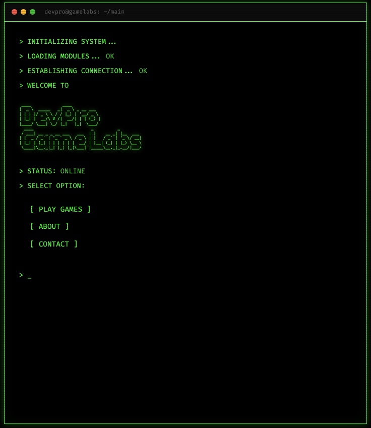
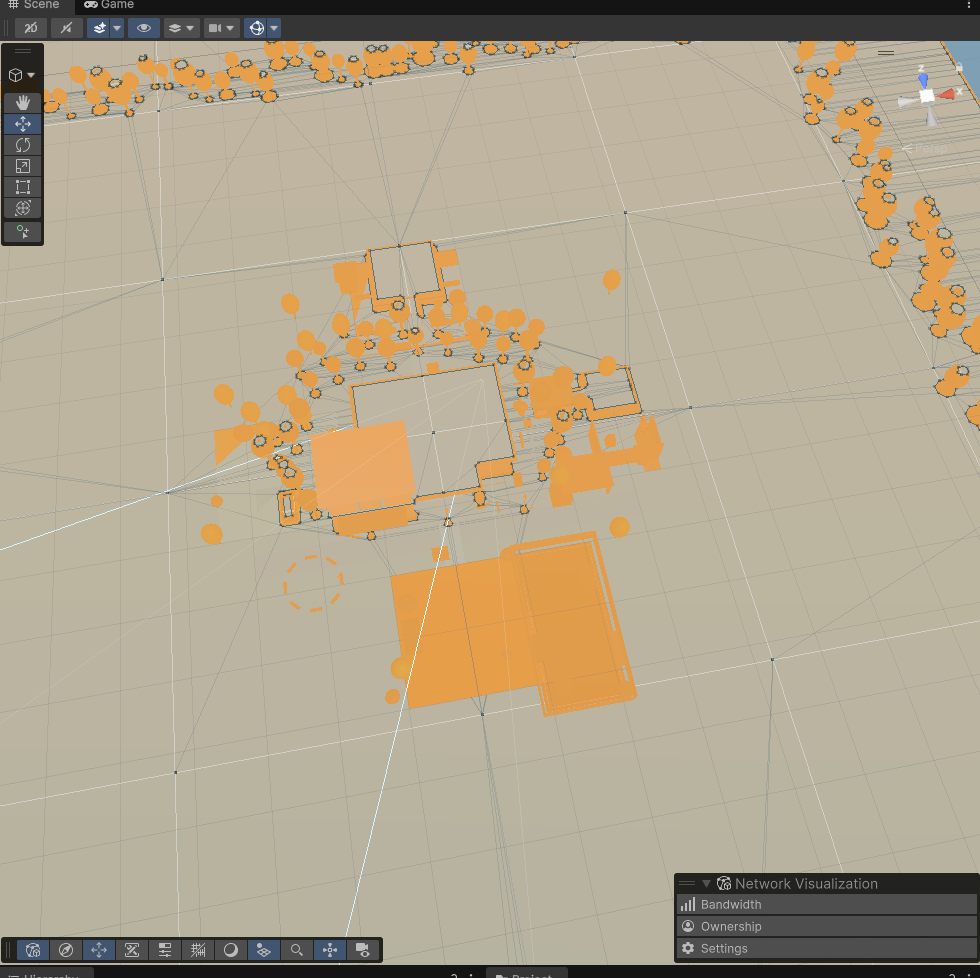

# Portal

Blazor WebAssembly SPA with a retro terminal aesthetic.

Serves as the landing page and game directory for DevPro Game Labs.

Experimenting in prompt based game development.

## Survival Shooter:
https://unity-game-builds-668191889297.s3.us-east-1.amazonaws.com/mcp-unity-1/index.html






## Tech Stack

- .NET 9.0 Blazor WebAssembly
- CSS3 animations (scanlines, glow, boot sequence)
- Fira Code monospace font

## Structure

```
portal/
├── Program.cs              # WebAssembly entry point
├── App.razor               # Root routing component
├── Pages/
│   ├── Home.razor          # Landing page (/)
│   └── Games.razor         # Game directory (/games)
├── Layout/
│   └── MainLayout.razor    # Layout wrapper
└── wwwroot/
    ├── index.html          # HTML shell
    └── css/app.css         # Terminal-style CSS
```

## Running Locally

```bash
dotnet run
```

## Publishing

```bash
dotnet publish -c Release
```

Output goes to `bin/Release/net9.0/publish/wwwroot/` — this is what gets deployed to S3.

## Adding a Game

Edit `Pages/Games.razor` and add an entry to the `games` array:

```csharp
new(2, "My New Game", "/games/my-new-game/")
```
